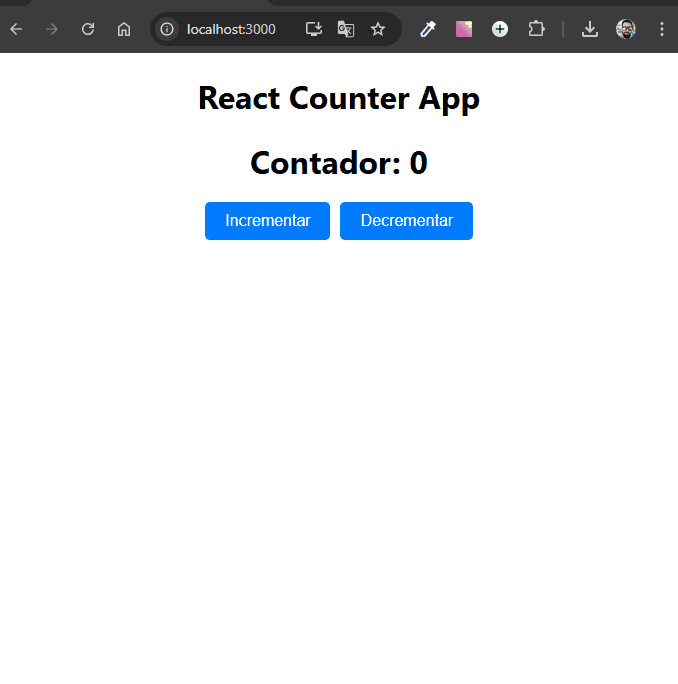

# App contador com React.js

Desenvolvido como atividade prática da disciplina **Desenvolvimento com React** no curso de **Sistemas de Informação**.

Este projeto é uma implementação de uma página web simples em **React** que demonstra a funcionalidade de um contador.<br>
O contador permite aumentar ou diminuir o valor exibido clicando em botões.<br><br>
A funcionalidades se basea em aumentar valor quando o uduário clica no botão "incrementar" para incrementar o contador e diminuir o valor ao clicar no botão "decrementar" para decrementar o contador.



## Tecnologias Utilizadas

- **Next.js**
- **React**
- **JavaScript**
- **HTML**
- **CSS**

## Estrutura de Pastas

```
📦 app-contador-com-react
 ┣ 📂 node_modules
 ┃ ┗ 📜 ...
 ┣ 📂 public
 ┃ ┣ 📜 index.html
 ┃ ┗ 🖼️ favicon.ico
 ┣ 📂 src
 ┃ ┣ 📜 App.js
 ┃ ┣ 📜 FormularioEmail.js
 ┃ ┣ 📜 index.css
 ┃ ┗ 📜 index.js
 ┣ 📜 .gitignore
 ┣ 📜 package-lock.json
 ┣ 📜 package.json
 ┣ 🖼️ contador-com-react.gif
 ┗ 📜 README.md
```

## Como Usar

1. Clone o repositório:

   ```bash
   git clone https://github.com/Alberesbass/soma-numeros.git
   ```

2. Acesse o diretório do projeto:

   ```bash
   cd soma-numeros
   ```

3. Instale as dependências:

   ```bash
   npm install
   ```

4. Inicie o servidor de desenvolvimento:

   ```bash
   npm run dev
   ```

5. Abra o navegador e acesse `http://localhost:3000` para visualizar o projeto.

## Licença

Este projeto está sob a licença MIT. Consulte o arquivo [LICENSE](./LICENSE) para mais informações.

---

Desenvolvido por [Alberes](https://github.com/Alberesbass)

---
